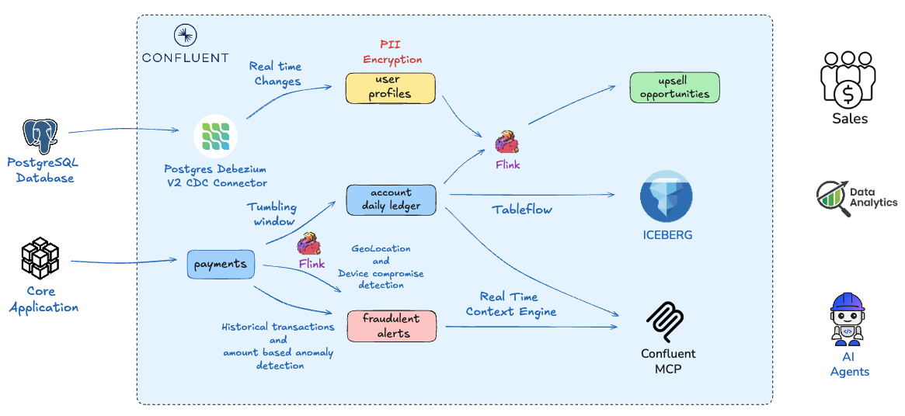

# Real-Time Financial Intelligence Platform

This repository provisions an end-to-end real-time financial intelligence, processing, and data lake syncing blueprint using **Terraform**. It configures an AWS RDS PostgreSQL instance optimized for Debezium Change Data Capture (CDC), establishes stream pipelines within **Confluent Cloud**, runs continuous stream computations via **Apache Flink**, executes Client-Side Field-Level Encryption (**CSFLE**), and continuously materializes live events into an Amazon S3 data lake as **Apache Iceberg** tables via **Tableflow** linked directly to an AWS Glue Data Catalog.

 

---

## **Agenda**
1. [Setup Prerequisites](#step-1)
2. [Project Initialization](#step-2)
3. [Set Credentials & Variables](#step-3)
4. [Deployment](#step-4)
5. [Add-On & Architecture Setup](#step-5)
6. [Cleanup](#step-6)

---

## <a name="step-1"></a>Setup Prerequisites

### Required Local Engine Tools
* **Terraform**
* **Docker Engine** (Required to dynamically construct, build, and run the Python transactional data generator app)

### Credentials & Cloud Access
* **AWS Access Credentials** (Permissions for Identity & Access Management (IAM), RDS Postgres, S3, KMS Key Rings, and Glue Data Catalog)
* **Confluent Cloud API Keys** (Created with Cloud Resource Manager administration scopes)

---

## <a name="step-2"></a>Project Initialization

Clone your environment repository locally, navigate to the target module directory, and initialize the active working blueprint:

```bash
git clone https://github.com/confluentinc/global-scale-demos.git
cd global-scale-demos/BFSI/financial-intelligence/terraform/
terraform init
```

## <a name="step-3"></a>Set Credentials & Variables

Export the layout specifications as environment variables within your terminal workspace profile before executing the deployment lifecycle:

```bash
# General Infrastructure Variables
export TF_VAR_project_name="financial-intelligence"
export TF_VAR_aws_region="ap-south-1"
export TF_VAR_hardware="Aarch64" #Configured for MAC # Switch alternative targets to x86_64 depending on your local machine profile

# Confluent Cloud Administration Keys
export TF_VAR_confluent_cloud_api_key="<YOUR_CONFLUENT_CLOUD_RESOURCE_API_KEY>"
export TF_VAR_confluent_cloud_api_secret="<YOUR_CONFLUENT_CLOUD_RESOURCE_API_SECRET>"

# AWS Pipeline Access Permissions
export AWS_ACCESS_KEY_ID="<YOUR_AWS_ACCESS_KEY_ID>"
export AWS_SECRET_ACCESS_KEY="<YOUR_AWS_SECRET_ACCESS_KEY>"
export AWS_SESSION_TOKEN="<YOUR_AWS_SESSION_TOKEN>" # Maintain blank if your IAM profiles do not use temporary tokens
```

[!TIP]
Confirm your local Docker service daemon is fully active before applying infrastructure. Terraform requires direct Docker runtime access to assemble the automated data generation container image.

## <a name="step-4"></a>Deployment

Inspect the generation strategy graph to validate structural references and IAM security permissions:

```bash
terraform plan
```

Deploy the end-to-end real-time platform components:

```bash
terraform apply
```

[!NOTE]
This automation script spins up a secure RDS postgres instance, registers Avro streaming definitions, creates localized container runtimes, and links processing streams. Expect an operational deployment time of 10 to 15 minutes.


## <a name="step-5"></a>Add-On & Architecture Setup

Once the deployment completes, check the terminal shell outputs for access metrics. The provisioned platform builds out the following operational pipeline architecture:

1. Ingestion & Security Governance
Python Data Generator: A custom app built inside Docker that feeds random transaction data directly to confluent cloud.

Debezium CDC Connector: Monitors database changes, publishing updates as structured Avro messages.

PII Governance (CSFLE): Automatically routes incoming updates with PII schema tags through client-side encryption using an AWS KMS key. Payloads that fail encryption redirect safely to a dead-letter queue (failed-encryption-records).

2. Live Stream Processing (Apache Flink Engine)
Confluent Flink actively runs continuous analytical logics over payments topic:

account_daily_ledger: Aggregates structured transaction logs down into a 5-minute sliding window calculation track (net_amount_change_5min, transaction frequencies).

Potential Fraud Analytics Engine (fraudulent_alerts):

Impossible Travel Alerts: Catches sequential purchases flipping geographic boundaries in short time frames (< 10minutes).

Device Switch Detection: Signals immediate threats when distinct payment devices execute back-to-back signatures under 60 seconds.

Statistical Anomalies: Looks for extreme changes in purchasing patterns using out-of-the-box ARIMA model on confluent cloud.

upsell_opportunities: Tracks customer usage data in real-time, automatically prompting recommendations for targeted financial products (like corporate cards or managed portfolios) when accounts hit premium velocity parameters.

3. Lakehouse Synchronization (Tableflow)
Live event changes targeted at the windowed account_daily_ledger query stream are instantly mirrored to S3 Bucket as Apache Iceberg formatted tables. Metadata objects sync to AWS Glue Catalog seamlessly.

4. AI Tool Context Engine Integration
The build writes an ibm-bob-mcp.json file to the terraform folder. This file registers your Confluent Real-Time Context Engine (RTCE) endpoint with Model Context Protocol (MCP) compatible tools, allowing AI assistants to query your real-time data streaming graphs.

## <a name="step-6"></a>Cleanup

Because specific platform instances cross-bind policy parameters between AWS KMS and Confluent Cloud environments, certain dependency tracking states must be isolated from the system graph before performing a total cluster wipe. Cleanly disassemble your testing environment using the following steps:


```bash
terraform destroy -auto-approve

#Required if above command gives error
terraform state rm confluent_schema_registry_kek.aws_kms_csfle_key confluent_provider_integration.main
terraform destroy -auto-approve
```