# Financial Intelligence Workshop — Attendee Guide

You're building a real-time financial intelligence pipeline on **Confluent Cloud**, by
hand.

## Agenda

1. [Prerequisites](#step-1-prerequisites)
2. [Your Confluent Cloud environment](#step-2-your-confluent-cloud-environment)
3. [MongoDB Atlas Source connector](#step-3-mongodb-atlas-source-connector)
4. [The Flink SQL pipeline](#step-4-the-flink-sql-pipeline)
5. [Lakehouse sync with Tableflow](#step-5-lakehouse-sync-with-tableflow)
6. [Clean up](#step-6-clean-up)
7. [Appendix: AI tool context (RTCE / MCP)](#appendix-ai-tool-context-rtce--mcp)

---

## Step 1: Prerequisites

### Accounts

1. **A Confluent Cloud account.**
   [Sign up here](https://www.confluent.io/confluent-cloud/tryfree/) — new accounts
   include free credits that comfortably cover a workshop session. Use **your own**
   account/organization, separate from every other attendee.

That's the only account you personally need.

### Access your instructor will give you

Get these from your instructor before Step 3:

- MongoDB connection host/URI (read-only user)
- Database name: `finintel`

### Optional but recommended

- The [Confluent CLI](https://docs.confluent.io/confluent-cli/current/install.html)
  installed locally — useful for Tableflow verification in Step 5, and for tailing
  Flink statement logs if something doesn't behave as expected. Everything in this
  workshop can also be done entirely from the Confluent Cloud Console UI if you'd
  rather not install anything.

### Sanity check

Log in to [confluent.cloud](https://confluent.cloud) and confirm you can see the
"Environments" page. If this is a brand-new account you may be prompted to create your
first environment — hold off, that's covered explicitly in Step 2 below.

<div align="center" padding=25px>
    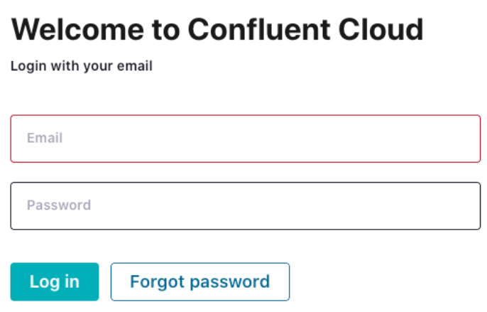
</div>

---

## Step 2: Your Confluent Cloud Environment

Everything in this workshop lives inside one environment, in your own account, so you
can freely name things without colliding with anyone else in the room.

### 2.1 Create an environment

1. In the Confluent Cloud Console, go to **Environments** → **Add cloud environment**.
2. Name it something recognizable, e.g. `<your-name>-finintel-workshop`.
3. Choose the **Essentials** stream governance package — that's all this workshop
   needs.

<div align="center" padding=25px>
    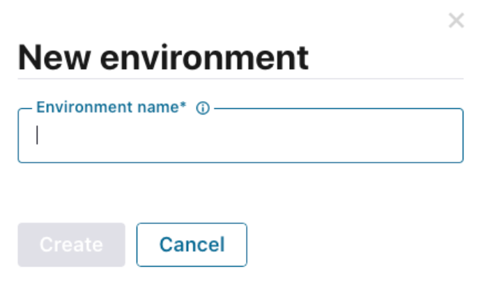
</div>

### 2.2 Create a Kafka cluster

1. Inside your new environment, **Add cluster**.
2. Choose **Basic** (cheapest, sufficient for workshop TPS).

<div align="center" padding=25px>
    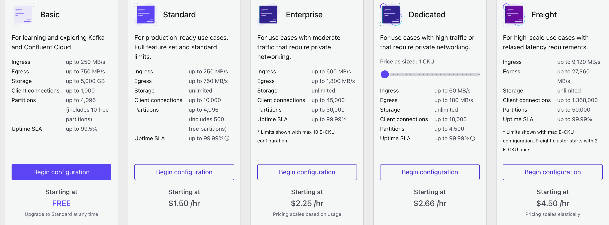
</div>

3. Cloud provider: **AWS**. Region: **us-east-1 (N. Virginia)**.
4. Name it e.g. `finintel-cluster`.

<div align="center" padding=25px>
    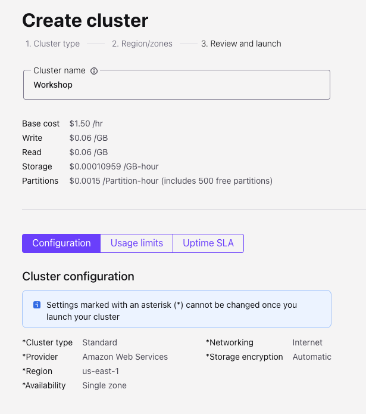
</div>

### 2.3 Create a Flink compute pool

1. In the left nav, go to **Flink** → **Compute Pools** → **Create compute pool**.

<div align="center" padding=25px>
    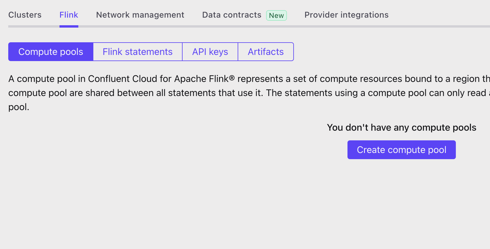
</div>

2. Cloud provider **AWS**, region **us-east-1** — same as your Kafka cluster.

<div align="center" padding=25px>
    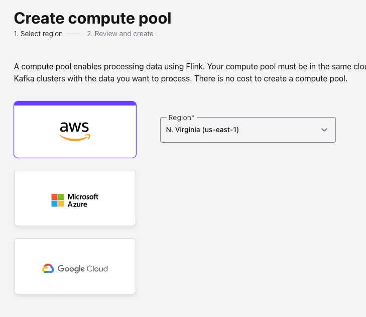
</div>

3. Max CFU: **10** is plenty for the three statements in this workshop.
4. Name it e.g. `finintel-flink-pool`.

<div align="center" padding=25px>
    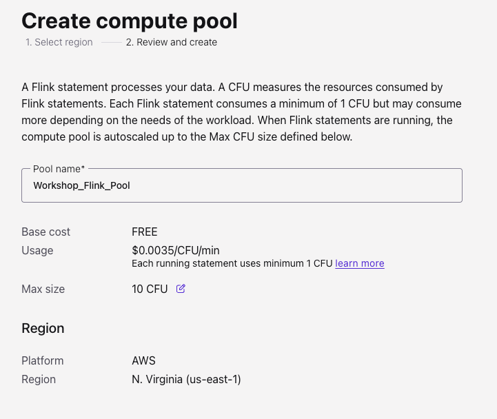
</div>

### 2.4 Create a Kafka API key

No service account needed — since this is your own account, you're already the owner
of everything in it. The Flink SQL workspace in the console authenticates as you
automatically, so the only credential you need to create by hand is a Kafka API key
for the connectors in Step 3.

In the Console: go to your cluster's **API Keys** tab → **Add key** → **My account**
(not "Service account") → this generates a key/secret scoped to your own user
identity, with access to everything you own.

<div align="center" padding=25px>
    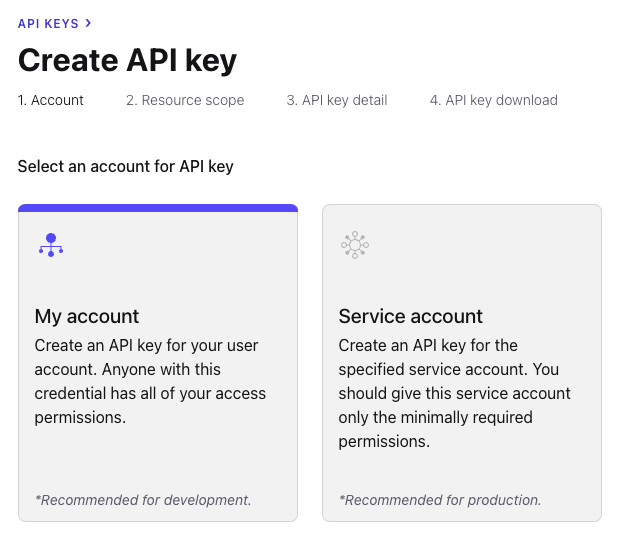
</div>

<div align="center" padding=25px>
    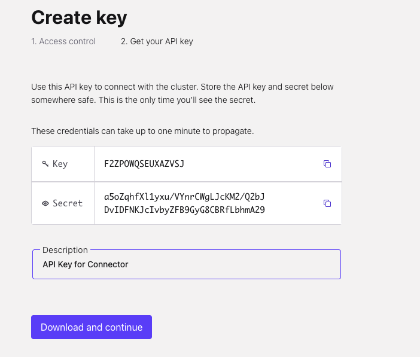
</div>

> **Tip:** Note the API key/secret somewhere safe (a password manager, not a shared
> doc) — you'll paste it into the connector config in the next step.

**Checkpoint:** one environment, one Basic Kafka cluster, one Flink compute pool, and
one Kafka API key tied to your user account.

---

## Step 3: MongoDB Atlas Source Connector

One connector reads the whole `finintel` database and creates one topic per
collection automatically — you don't pick collections one at a time. Every attendee
runs their own copy against the same MongoDB instance — you're all reading the same
source data independently.

### 3.1 Add the connector

1. In your cluster, go to **Connectors** → search for **MongoDB Atlas Source** →
   **Add connector**.
2. Enter the following configuration details. The remaining fields can be left blank
   or default.

| Setting                            | Value                          |
|-------------------------------------|---------------------------------|
| Topic prefix                       | `cdc`                          |
| API Key                            | *the Kafka API key from Step 2.4* |
| API Secret                         | *the Kafka API secret from Step 2.4* |
| Connection host                    | *the Atlas cluster host your instructor gave you* |
| Connection user                    | *the read-only username your instructor gave you* |
| Connection password                | *the read-only password your instructor gave you* |
| Database name                      | `finintel`                     |
| Output Kafka record value format   | AVRO                           |
| Publish full document only         | `true`                         |
| Startup mode                       | `copy_existing`                |
| Tasks                              | 1                              |
| Name                               | `finintel-mongodb-source`      |

Two settings are worth calling out:

- **Publish full document only (`true`)** — without this, the connector emits a full
  change-stream event (`{_id, operationType, documentKey, fullDocument, ns, ...}`)
  instead of the document's fields directly at the top level, and the Flink SQL in
  Step 4 won't find columns like `user_id` or `amount` where it expects them.
- **Startup mode (`copy_existing`)** — this copies the collections' existing documents
  first, then continues streaming new changes, so you see data immediately instead of
  waiting for the next change to happen.

3. Review your selections and **Launch**.

### 3.2 Verify

Once the connector reaches **Running**:

1. Go to **Topics** in your cluster. You should see two new topics appear
   automatically — one per collection: `cdc.finintel.user_profiles` and
   `cdc.finintel.payments`.
2. Open the **Messages** tab on `cdc.finintel.payments` and confirm you see live
   documents flowing in — top-level fields like `transaction_id`, `user_id`, `amount`,
   `address.city`, etc. — **not** wrapped in a change-stream envelope. If you do see an
   envelope (fields like `operationType`, `fullDocument`, `ns`), go back and turn on
   **Publish full document only** before continuing.

**Checkpoint:** one connector running, two topics actively receiving records, with
flattened document fields at the top level.

---

## Step 4: The Flink SQL Pipeline

Open **Flink → Workspaces** in the console, create a new workspace against your compute
pool. Optionally rename it (click the settings button, update the name, **Save
changes**).

<div align="center" padding=25px>
    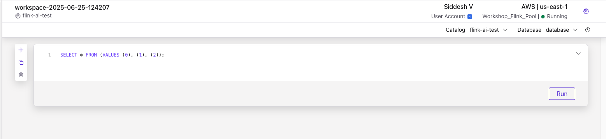
</div>

Set the **Catalog** to your environment name.

<div align="center" padding=25px>
    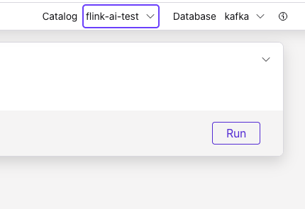
</div>

Set the **Database** to your cluster name.

<div align="center" padding=25px>
    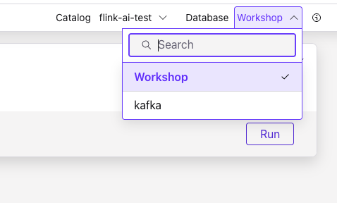
</div>

Kafka topics and schemas are always in sync with Flink — any topic created by the
connector in Step 3 is visible directly as a table in Flink, under its full topic name.
The statements below reference the connector's output topic directly as
`` `cdc.finintel.payments` `` — no view or alias needed first. (The other topic the
connector created, `` `cdc.finintel.user_profiles` ``, isn't used by the three core
statements below, but you can query it the same way if you want to explore joining
transaction activity back to user profile attributes.)

Run each statement below **in order**, one at a time, and confirm it reaches `RUNNING`
before moving to the next.

### 4.1 `account_daily_ledger`

A 5-minute tumbling window per account: total received, total debited, net change, and
credit/debit/combined transaction counts.

```sql
CREATE TABLE `account_daily_ledger` (
  `account_no`                        VARCHAR(2147483647) NOT NULL,
  `window_start`                       TIMESTAMP(3) NOT NULL,
  `window_end`                         TIMESTAMP(3) NOT NULL,
  `total_received_amount_5min`         DOUBLE NOT NULL,
  `total_debited_amount_5min`          DOUBLE NOT NULL,
  `net_amount_change_5min`             DOUBLE NOT NULL,
  `total_credit_transactions_5min`     BIGINT NOT NULL,
  `total_debit_transactions_5min`      BIGINT NOT NULL,
  `total_combined_transactions_5min`   BIGINT NOT NULL,
  PRIMARY KEY (account_no) NOT ENFORCED
);
```

Run the `CREATE TABLE` first, then run the `INSERT INTO` below as a **second, separate
statement** — this becomes your long-running streaming job, leave it running:

```sql
INSERT INTO account_daily_ledger
WITH normalized_ledger AS (
    SELECT payee_account_no AS account_no,
           amount           AS received_amount,
           0                AS debited_amount,
           `$rowtime`       AS rt
    FROM `cdc.finintel.payments`
    UNION ALL
    SELECT payer_account_no AS account_no,
           0                AS received_amount,
           amount           AS debited_amount,
           `$rowtime`       AS rt
    FROM `cdc.finintel.payments`
)
SELECT
    account_no,
    window_start,
    window_end,
    SUM(received_amount) AS total_received_amount_5min,
    SUM(debited_amount)  AS total_debited_amount_5min,
    (SUM(received_amount) - SUM(debited_amount)) AS net_amount_change_5min,
    COUNT(CASE WHEN received_amount > 0 THEN 1 END) AS total_credit_transactions_5min,
    COUNT(CASE WHEN debited_amount > 0 THEN 1 END)  AS total_debit_transactions_5min,
    COUNT(*) AS total_combined_transactions_5min
FROM TABLE(
    TUMBLE(TABLE normalized_ledger, DESCRIPTOR(rt), INTERVAL '5' MINUTE)
)
GROUP BY account_no, window_start, window_end;
```

### 4.2 `fraudulent_alerts`

Three fraud patterns detected over the same `cdc.finintel.payments` stream:

- **Impossible travel** — a `MATCH_RECOGNIZE` pattern flags consecutive transactions
  from the same user in different countries less than 10 minutes apart.
- **Rapid device switching** — same pattern, but for device_id changes less than 60
  seconds apart.
- **Amount anomalies** — the built-in `ML_DETECT_ANOMALIES` function flags statistical
  outliers (95% confidence) over $1000.

```sql
CREATE TABLE fraudulent_alerts (
  user_id           STRING,
  transaction_id    STRING,
  alert_type        STRING,
  reason            STRING,
  alert_timestamp   TIMESTAMP(3),
  PRIMARY KEY (user_id) NOT ENFORCED
);
```

```sql
INSERT INTO fraudulent_alerts
WITH flattened_payments AS (
    SELECT transaction_id, user_id, user_name, device_id,
           payment_method, amount, `$rowtime` AS ts,
           address.country AS country
    FROM `cdc.finintel.payments`
),

impossible_travel_alerts AS (
    SELECT
        user_id,
        fraudulent_txn_id AS transaction_id,
        'IMPOSSIBLE_TRAVEL' AS alert_type,
        'User traveled from ' || first_country || ' to ' || second_country || ' in ' ||
            CAST(TIMESTAMPDIFF(MINUTE, first_txn_time, second_txn_time) AS STRING) || ' minutes.' AS reason,
        CAST(second_txn_time AS TIMESTAMP_LTZ(3)) AS alert_timestamp
    FROM flattened_payments
    MATCH_RECOGNIZE (
        PARTITION BY user_id
        ORDER BY ts
        MEASURES
            CURR_TXN.transaction_id AS fraudulent_txn_id,
            PREV_TXN.country        AS first_country,
            CURR_TXN.country        AS second_country,
            PREV_TXN.ts             AS first_txn_time,
            CURR_TXN.ts             AS second_txn_time
        ONE ROW PER MATCH
        AFTER MATCH SKIP TO NEXT ROW
        PATTERN (PREV_TXN CURR_TXN)
        DEFINE
            CURR_TXN AS CURR_TXN.country <> PREV_TXN.country
                    AND CURR_TXN.ts <= PREV_TXN.ts + INTERVAL '10' MINUTE
    )
),

device_switch_alerts AS (
    SELECT
        user_id,
        fraudulent_txn_id AS transaction_id,
        'FREQUENT_DEVICE_SWITCH' AS alert_type,
        'Payment initiated from device_id ' || first_device_id || ' and device_id ' || second_device_id ||
            ' in ' || CAST(TIMESTAMPDIFF(SECOND, first_txn_time, second_txn_time) AS STRING) || ' seconds interval.' AS reason,
        CAST(second_txn_time AS TIMESTAMP_LTZ(3)) AS alert_timestamp
    FROM flattened_payments
    MATCH_RECOGNIZE (
        PARTITION BY user_id
        ORDER BY ts
        MEASURES
            CURR_TXN.transaction_id AS fraudulent_txn_id,
            PREV_TXN.device_id      AS first_device_id,
            CURR_TXN.device_id      AS second_device_id,
            PREV_TXN.ts             AS first_txn_time,
            CURR_TXN.ts             AS second_txn_time
        ONE ROW PER MATCH
        AFTER MATCH SKIP TO NEXT ROW
        PATTERN (PREV_TXN CURR_TXN)
        DEFINE
            CURR_TXN AS CURR_TXN.device_id <> PREV_TXN.device_id
                    AND CURR_TXN.ts <= PREV_TXN.ts + INTERVAL '1' MINUTE
    )
),

amount_anomaly_alerts AS (
    SELECT
        user_id,
        transaction_id,
        'AMOUNT_ANOMALY' AS alert_type,
        'Transaction amount of ' || CAST(amount AS STRING) || ' flagged as an anomaly with 95% confidence.' AS reason,
        CAST(ts AS TIMESTAMP_LTZ(3)) AS alert_timestamp
    FROM (
        SELECT
            user_id, transaction_id, amount, ts,
            ML_DETECT_ANOMALIES(
                amount, ts,
                JSON_OBJECT('minTrainingSize' VALUE 10, 'confidencePercentage' VALUE 95.0, 'enableStl' VALUE false)
            ) OVER (
                PARTITION BY user_id ORDER BY ts
                RANGE BETWEEN UNBOUNDED PRECEDING AND CURRENT ROW
            ) AS anomaly_results
        FROM flattened_payments
    )
    WHERE anomaly_results[6] IS True AND amount > 1000
)

SELECT * FROM impossible_travel_alerts
UNION ALL
SELECT * FROM device_switch_alerts
UNION ALL
SELECT * FROM amount_anomaly_alerts;
```

### 4.3 `upsell_opportunities`

Classifies each account's 5-minute activity (from `account_daily_ledger`, so this
statement depends on 4.1 already running) into a lead type and recommends a matching
financial product with a priority tier.

```sql
CREATE TABLE upsell_opportunities (
  account_no             STRING,
  window_end             TIMESTAMP(3),
  lead_type              STRING,
  recommended_product    STRING,
  priority               STRING,
  trigger_metric_value   DECIMAL(18, 2),
  PRIMARY KEY (account_no) NOT ENFORCED
) WITH ('changelog.mode' = 'upsert');
```

```sql
INSERT INTO upsell_opportunities
SELECT
    account_no,
    window_end,

    CASE
        WHEN total_debited_amount_5min >= 5000       THEN 'HIGH_DEBIT_VOLUME'
        WHEN total_debit_transactions_5min >= 10      THEN 'HIGH_DEBIT_FREQUENCY'
        WHEN total_received_amount_5min >= 5000       THEN 'HIGH_CREDIT_VOLUME'
        WHEN total_combined_transactions_5min >= 10   THEN 'HIGH_VELOCITY_MERCHANT'
        ELSE 'STANDARD_ACTIVITY'
    END AS lead_type,

    CASE
        WHEN total_debited_amount_5min >= 5000       THEN 'Corporate Credit Card / Working Capital Line'
        WHEN total_debit_transactions_5min >= 10      THEN 'Automated Debit Accounts / Batch Payables API'
        WHEN total_received_amount_5min >= 5000       THEN 'High-Yield Investment Product / Managed Portfolio'
        WHEN total_combined_transactions_5min >= 10   THEN 'Premium Merchant Services / POS Upgrade'
        ELSE 'None'
    END AS recommended_product,

    CASE
        WHEN total_debited_amount_5min >= 10000 OR total_received_amount_5min >= 10000 THEN 'HIGH'
        ELSE 'MEDIUM'
    END AS priority,

    CASE
        WHEN total_debited_amount_5min >= 5000 THEN total_debited_amount_5min
        ELSE total_received_amount_5min
    END AS trigger_metric_value

FROM account_daily_ledger
WHERE total_debited_amount_5min >= 5000
   OR total_debit_transactions_5min >= 10
   OR total_received_amount_5min >= 5000
   OR total_combined_transactions_5min >= 10;
```

### Verify

In the Flink workspace, run ad-hoc queries against each table while the INSERT
statements are running in the background:

```sql
SELECT * FROM account_daily_ledger LIMIT 10;
SELECT * FROM fraudulent_alerts ORDER BY alert_timestamp DESC LIMIT 10;
SELECT * FROM upsell_opportunities WHERE priority = 'HIGH' LIMIT 10;
```

You should see rows appearing within a few minutes, assuming the host's data generator
(`../host-setup/`) is running.

**Checkpoint:** three tables, each with a CREATE + INSERT pair, all `RUNNING`
(`account_daily_ledger`, `fraudulent_alerts`, `upsell_opportunities` — six statements
total).

---

## Step 5: Lakehouse Sync with Tableflow

Tableflow materializes `account_daily_ledger` as an Iceberg table you can query outside
of Kafka. This workshop uses Tableflow's **Confluent-managed storage** option, so
there's no AWS account, IAM role, or S3 bucket to set up.

### 5.1 Enable Tableflow

1. In your cluster, go to **Topics**, select `account_daily_ledger`.
2. Open the **Tableflow** tab → **Enable Tableflow**.
3. Table format: **Iceberg**.
4. Storage: choose **Confluent-managed storage** (do *not* pick "Bring your own
   bucket" — that's the AWS path this workshop skips).
5. Confirm. It may take a minute or two for the first sync to complete.

### 5.2 Verify

Once enabled, the topic's Tableflow tab shows sync status and the underlying Iceberg
table metadata. If you have the Confluent CLI configured:

```bash
confluent flink shell   # or use the Flink SQL workspace
SELECT * FROM account_daily_ledger;
```

Tableflow doesn't change how you query from Flink — it's a parallel materialization for
external Iceberg-compatible query engines (Snowflake, Spark, Trino, etc.) to read the
same data outside of Kafka. Since we're on Confluent-managed storage rather than a
bucket in your own AWS account, connecting an external engine to it requires a
Confluent-issued catalog integration — out of scope for this workshop, but the
[Tableflow docs](https://docs.confluent.io/cloud/current/topics/tableflow/overview.html)
cover it if you want to explore further after the session.

**Checkpoint:** `account_daily_ledger` shows Tableflow status "Syncing" or "Synced".

---

## Step 6: Clean Up

Everything you built lives entirely in your own Confluent Cloud environment, so
cleanup is simple — you don't need to worry about anyone else's resources.

### 6.1 Stop the Flink statements

In **Flink → Statements**, stop (or delete) each of:

- `insert_account_daily_ledger_query` (or whatever you named it)
- `insert_fraudulent_alerts_query`
- `insert_upsell_opportunities_query`

Deleting the INSERT statements is enough to stop billing for the streaming jobs; the
CREATE TABLE statements and the tables themselves can stay if you want to keep
exploring the data already produced, or delete them too for a full teardown.

### 6.2 Delete the connector

**Connectors → `finintel-mongodb-source` → Delete.** This stops reading from the
shared MongoDB — please do this before you leave so the shared Mongo instance isn't
serving read load from idle connectors after the workshop ends.

### 6.3 Delete the Flink compute pool

**Flink → Compute Pools → your pool → Delete.** Compute pools bill by CFU-hour while
they exist, whether or not statements are running against them.

<div align="center" padding=25px>
    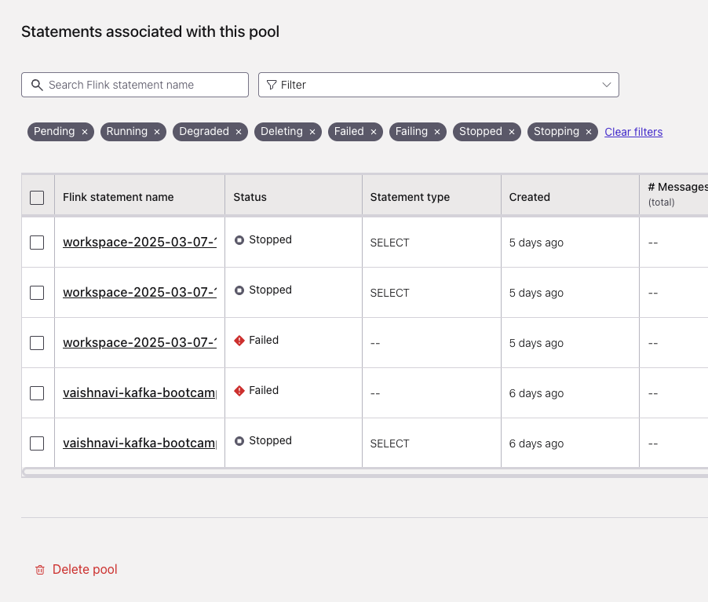
</div>

### 6.4 Delete the Kafka cluster and environment

**Environment → your cluster → Delete**, then delete the environment itself. This also
removes the Tableflow-managed storage created in Step 5 — it's scoped to the topic/
environment, nothing external to clean up.

<div align="center" padding=25px>
    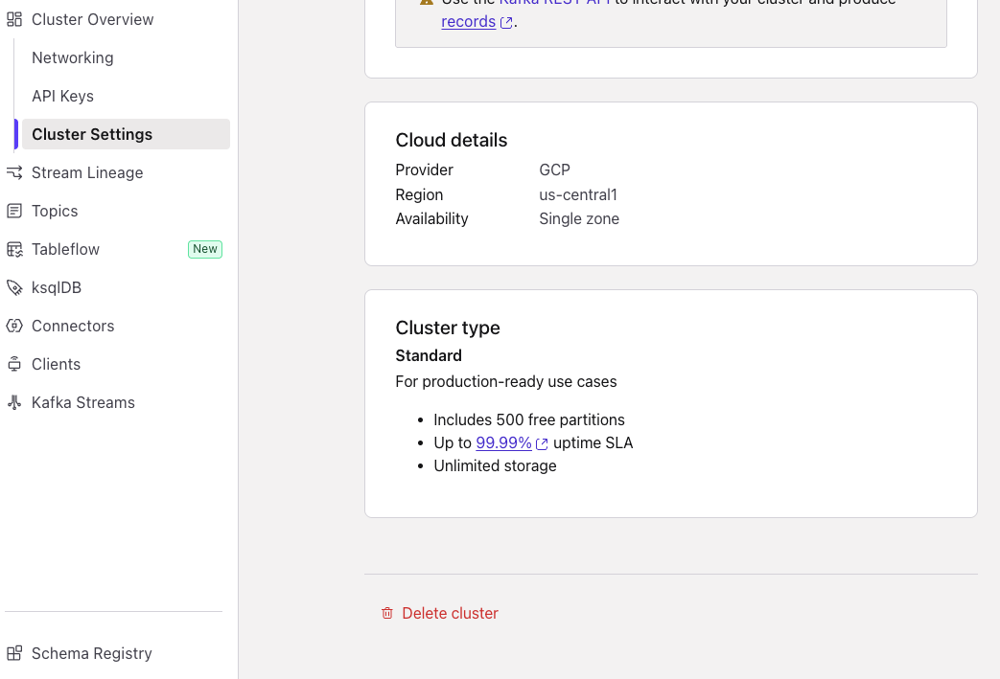
</div>

<div align="center" padding=25px>
    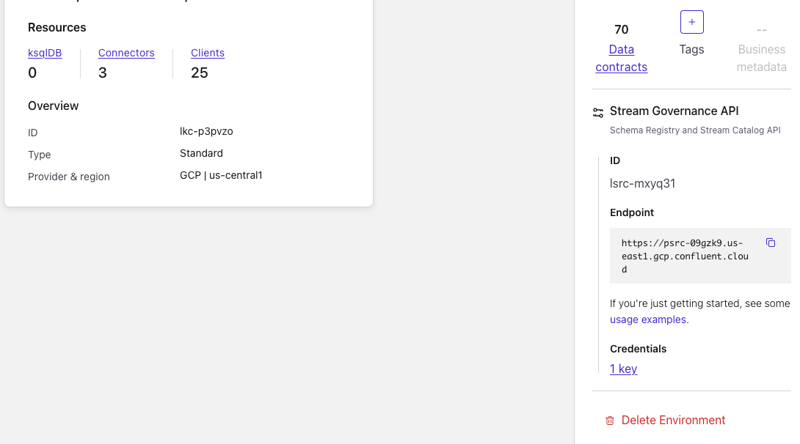
</div>

### Full teardown, fastest path

If you don't need anything you built, the single fastest cleanup is: delete the
**environment**. Deleting an environment in Confluent Cloud cascades to every cluster,
connector, Flink resource, and API key inside it.

---

## Appendix: AI Tool Context (RTCE / MCP)

Optional — try this if you finish the core lab early. RTCE (Confluent's Real-Time
Context Engine) needs nothing beyond your existing Confluent Cloud environment.

### What it does

RTCE exposes a live Kafka topic as a queryable endpoint for AI assistants over the
Model Context Protocol (MCP), so an MCP-compatible assistant can answer questions
against your streaming `account_daily_ledger` data directly.

### Steps

1. In your cluster, select the `account_daily_ledger` topic → enable **Real-Time
   Context Engine** from the topic's settings.
2. Generate a **global API key** for your user account (Environment → Access →
   API Keys → Add key → owner: My account → scope: Global, not tied to one cluster).
3. Build the MCP endpoint URL:

   ```
   https://mcp.<region>.aws.confluent.cloud/mcp/v1/context-engine/organizations/<org-id>/environments/<env-id>/kafka-clusters/<cluster-id>
   ```

4. Base64-encode `<api-key-id>:<api-key-secret>` and use it as an HTTP Basic
   `Authorization` header.
5. Register it as an MCP server in your assistant of choice, e.g.:

   ```json
   {
     "mcpServers": {
       "confluent-rtce": {
         "type": "streamable-http",
         "url": "<the URL from step 3>",
         "headers": { "Authorization": "Basic <base64 value from step 4>" }
       }
     }
   }
   ```

6. Ask your assistant a question about live account activity and watch it query the
   stream directly.

<div align="center" padding=25px>
    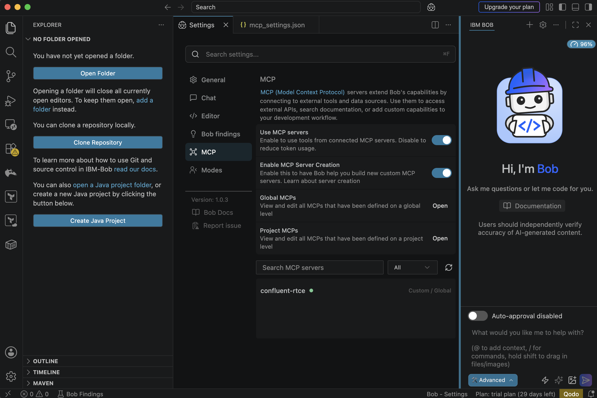
</div>
