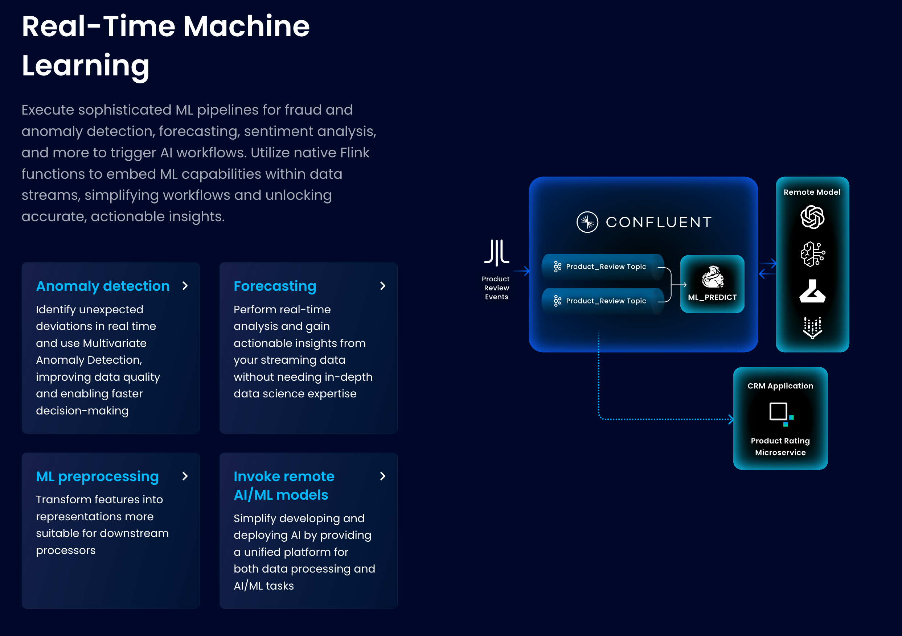
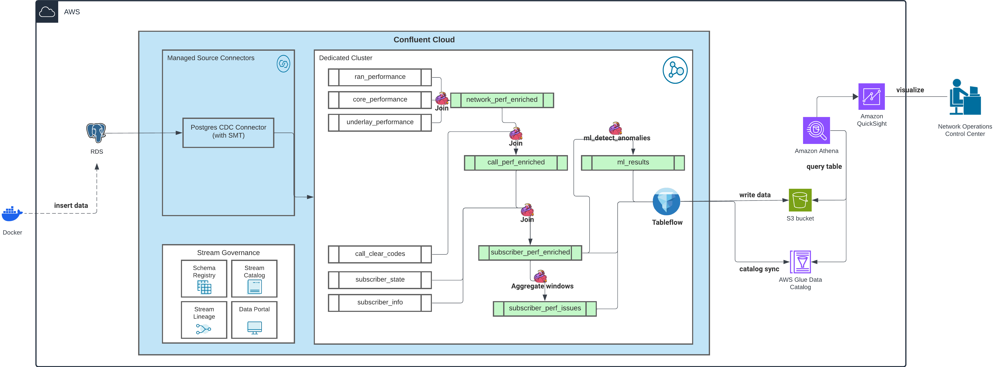
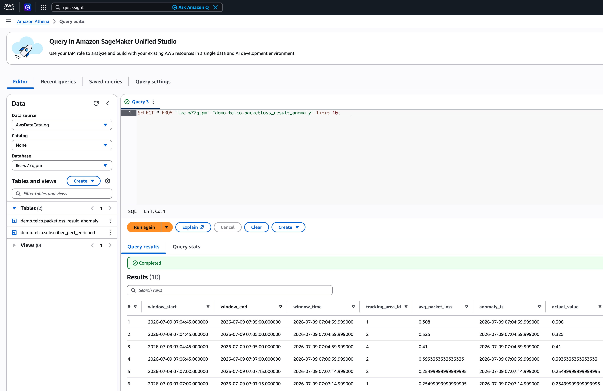
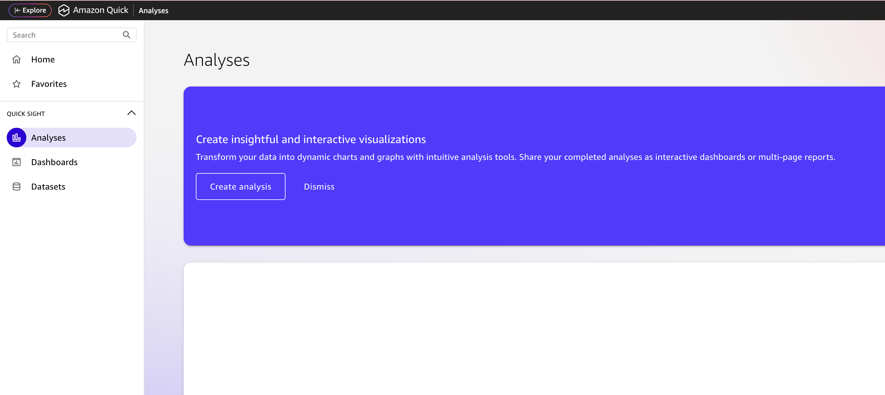
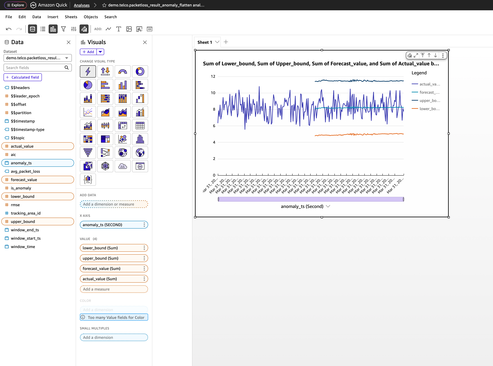
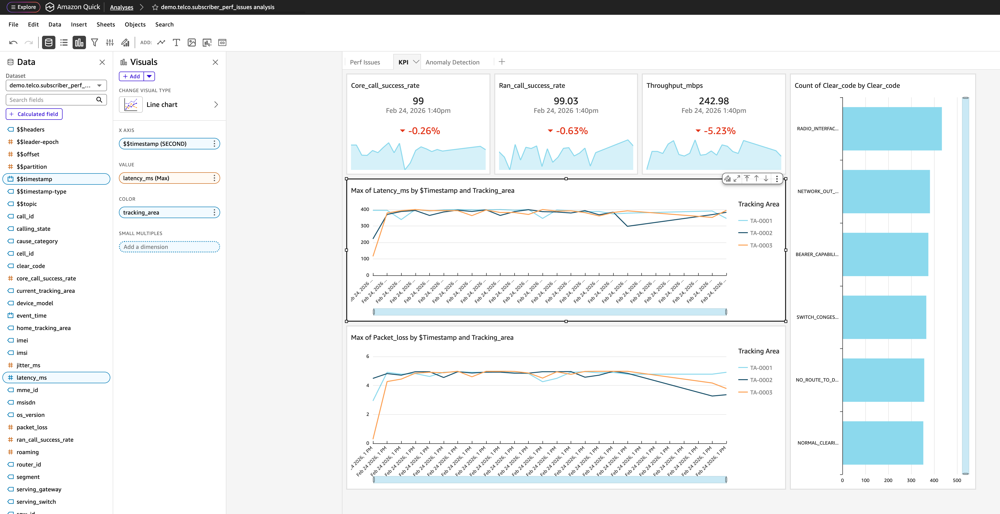

# Telco Predictive Analytics



This demo showcases the application of Flink ML function and Tableflow to enable quick analytics of Telco data in AWS Quicksight.

## **Agenda**
1. [Setup Prerequisites](#step-1)
2. [Project Initalization](#step-2)
3. [Set Credentials & Variables](#step-3)
4. [Deployment](#step-4)
5. [Add-On Setup](#step-5)
6. [Explore the Datalake Using Athena](#step-6)
7. [Build Your Own Analytics](#step-7)
8. [Cleanup](#step-8)

 

## <a name="step-1"></a>Setup Prerequisites
Required tools :
  - `Terraform`
  - `Docker`

Credentials & Access:
  - `AWS Access Keys`
  - `Confluent Cloud API Keys (Confluent Cloud Resource Manager)\nNOTE: for internal user please use user account instead of service account`
  - `AWS Quicksight Access`

## <a name="step-2"></a>Project Initalization
  - Clone Source Code
    
    ```bash
    git clone https://github.com/confluentinc/global-scale-demos.git
    cd global-scale-demos/Telco/telco-predictive-analytics
    ```

  - Initialize terraform and install required providers
    ```bash
    terraform init
    ```

  - Pull docker image for Postgres table initialization
    ```bash
    docker image pull postgres:16
    ```


## <a name="step-3"></a>Set Credentials & Variables
  ```bash

    # Update these variables
    
    #Required Always
    export TF_VAR_project_name="changeme-demo"
    export TF_VAR_confluent_cloud_api_key="<Confluent Cloud Resource Management API Key Name>"
    export TF_VAR_confluent_cloud_api_secret="<Confluent Cloud Resource Management API Key Secret>"
    export AWS_ACCESS_KEY_ID="<AWS User API Key ID>"
    export AWS_SECRET_ACCESS_KEY="<AWS User API Key Secret>"
    export AWS_SESSION_TOKEN="<AWS User Session Token>"
    export TF_VAR_aws_region="us-west-2"
  ```

## <a name="step-4"></a>Deployment
- Verify the resources
  ```bash
  terraform plan
  ```
- Deploy the resources
  ```bash
  terraform apply
  ```
> [!NOTE]
> This will take approx 15 minutes to deploy resources over AWS & Confluent

## <a name="step-5"></a>Add-on Setup
 
  Terraform will deploy almost everything, but still a few components should be managed via UI. 

- **Confluent**: Terraform will enable Tableflow for topic: subscriber_perf_enriched and packetloss_result_anomaly with ICEBERG format. If tableflow is not in sync or in failed state, you shall resume it. 

- **AWS Quicksight**: Build your analytics to visualize the gold table and anomaly detection result

## <a name="step-6"></a>Explore the Datalake Using Athena

- The Iceberg tables should be available in data catalog now. Let's query the tables using Athena.


## <a name="step-7"></a>Build Your Own Analytics

- You can choose to build analytics/dashboard using your favourite BI tools. 

- In this demo, AWS Quicksight is used as an example.

- Go to your Quicksight interface with selected region.

- Create analysis, select the dataset `demo.telco.packetloss_result_anomaly` that has been created in Terraform.


- Create a line chart for Anomaly Detection result:
    - `X axis: anomaly_ts`
    - `Value: actual_value, forecast_value, lower_bound, upper_bound`


- Explore more analytics by checking other gold tables (e.g. subscriber_perf_enriched):


> [!NOTE]
> It will take 15 minutes for the initial snapshot to be loaded into the dataset.

## <a name="step-8"></a>Cleanup
  ```bash
  # Destroy again if any failures.
  terraform destroy 
  
  # Use this command if the provider integration unable to destroy.
  terraform state rm confluent_provider_integration.main
  terraform destroy
  ```
