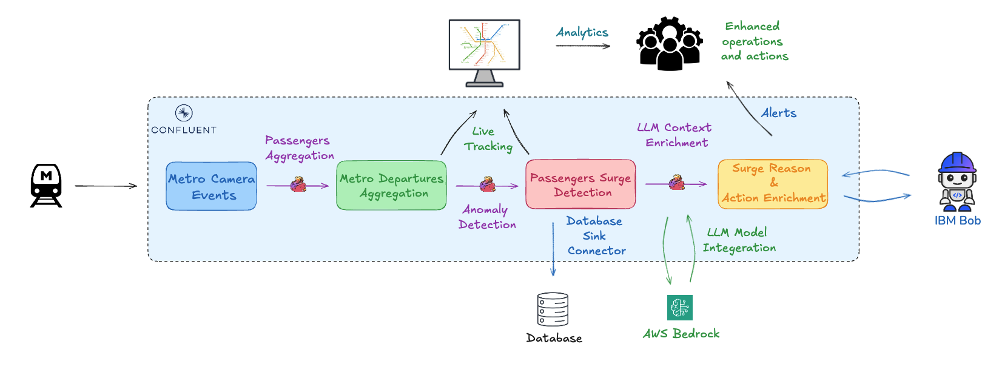

<div align="center">

# Real-Time Metro Intelligence on Confluent Cloud
### A Streaming, Flink SQL & Generative AI Workshop

</div>

This workshop builds a real-time operations platform for a metro rail network — a
9-line system (Red, Yellow, Blue, Green, Violet, Pink, Magenta, Grey, and an Orange
Airport Express line). You'll simulate a live sensor feed from onboard cameras, stream
it through Confluent Cloud, aggregate it with Flink SQL, visualize it on a real-time
map, and — optionally — layer on AI-powered anomaly detection and generative crowd
alerts using AWS Bedrock.

Everything in this workshop deploys with a single `terraform apply`.

### What You'll Build

1. **Real-time data generation** — a simulator publishing per-coach headcount events
   for a live fleet of trains across all 9 lines, timed against each line's real
   scheduled run time and a configurable train headway.
2. **Stream processing with Flink SQL** — windowed aggregations that turn raw
   per-coach events into per-train and per-station passenger totals.
3. **AI-powered anomaly detection** — Confluent Cloud Flink's built-in
   `ML_DETECT_ANOMALIES` function, layered with a baseline-ratio rule, to flag genuine
   passenger surges at a specific station.
4. **Generative AI alerts** — an AWS Bedrock model invoked through Flink SQL's
   `CREATE MODEL` and `ML_PREDICT`, turning a detected surge into a short, actionable
   control-room alert.
5. **Live visualization** — a real-time map showing every train in motion, live
   passenger counts, and surge alerts as they're detected.

## Architecture



Every train moves station-to-station at that segment's real travel time, calibrated
proportionally to its real distance within the line's real scheduled end-to-end run
time (Red 67 min, Yellow 76 min, Blue 105 min, Green 36 min, Violet 85 min, Pink 83
min, Magenta 82 min, Grey 6 min, Orange/Airport Express 20 min). Fleet size and train
spacing are derived from a configurable **headway** — the real-world gap between
consecutive trains on the same line and direction — rather than being hand-tuned per
line.

## Agenda

- [Prerequisites](#prerequisites)
- [Step 1: Deploy the stack](#step-1-deploy-the-stack)
- [Step 2: The data generator](#step-2-the-data-generator)
- [Step 3: The Flink SQL pipeline](#step-3-the-flink-sql-pipeline)
- [Step 4: The live map](#step-4-the-live-map)
- [Step 5 (Optional): AI-powered surge detection with Bedrock](#step-5-optional-ai-powered-surge-detection-with-bedrock)
- [Step 6: Clean up](#step-6-clean-up)
- [Repository structure](#repository-structure)
- [Further resources](#further-resources)

## Prerequisites

1. **A Confluent Cloud account.** [Sign up here](https://www.confluent.io/confluent-cloud/tryfree/)
   — new accounts include free credits that comfortably cover this workshop.
2. **[Terraform](https://developer.hashicorp.com/terraform/install)** >= 1.5.0
3. **[Docker](https://docs.docker.com/get-docker/)**, running locally.
4. *(Optional, for Step 5)* An **AWS account** with access to a Bedrock model
   (e.g. Anthropic Claude) in a supported region.

> **Note:** This workshop creates real billed resources in Confluent Cloud (and, if you
> enable Step 5, AWS Bedrock). Run `terraform destroy` (see [Step 6](#step-6-clean-up))
> when you're done to avoid ongoing charges.

## Step 1: Deploy the stack

The entire stack — a Confluent Cloud environment, a Basic Kafka cluster, a Flink
compute pool, the base Flink SQL statement, and the producer and live-map applications
running as Docker containers — deploys from one Terraform configuration.

```bash
cd terraform
cp terraform.tfvars.example terraform.tfvars   # fill in your Confluent Cloud API key + a unique project_name
terraform init
terraform apply
```

`apply` takes a few minutes — most of that time is Confluent Cloud provisioning the
Kafka cluster and Flink compute pool. Once it completes, open the URL printed as the
`live_map_url` output (`http://localhost:8765` by default). Give it a minute for the
producer to emit its first departures before trains appear on the map.

See [`terraform/README.md`](terraform/README.md) for the full list of variables,
outputs, and options.

## Step 2: The data generator

`producer/python-producer.py` simulates a live fleet of trains across all 9 lines,
publishing one event per coach every time a train departs a station. Each event
carries the train's line, direction, current and next station, and a simulated
headcount that varies by time of day (rush hour vs. off-peak) and by whether the
station is a real interchange hub.

Fleet size, train spacing, and each segment's travel time are all derived
automatically:

- **Train count per line** is computed from that line's real scheduled run time
  divided by the configured headway (`TRAIN_HEADWAY_SECONDS`, default 600s / 10
  minutes) — not hand-configured per line.
- **Segment travel times** are calibrated proportionally to each segment's real
  distance within its line's real total run time, using published transit network data.

Both the producer and the live map import a shared module, `metro_network.py`, which
holds the real station lists (in order, for all 9 lines), each line's real distance
and run time, and the route-building logic used to derive segment timings. Keeping
this in one shared file — rather than duplicating it into each app — guarantees the
producer and the map always agree on exactly what the network looks like.

Events are published as JSON, validated against a schema registered in Schema
Registry, to the `metro-camera-events` topic.

## Step 3: The Flink SQL pipeline

Flink SQL turns the raw per-coach event stream into meaningful aggregates:

```sql
-- Sums headcount across all 8 coaches of a single train's departure event.
CREATE TABLE metro_train_departures AS
SELECT
    window_start AS departure_window_start,
    window_end   AS departure_window_end,
    `metadata`.`metro_line`      AS metro_line,
    `metadata`.`direction`       AS direction,
    `metadata`.`train_id`        AS train_id,
    `location`.`current_station` AS current_station,
    `location`.`next_station`    AS next_station,
    SUM(`telemetry`.`headcount`) AS train_headcount
FROM TABLE(
    TUMBLE(TABLE `metro-camera-events`, DESCRIPTOR($rowtime), INTERVAL '1' MINUTE)
)
GROUP BY window_start, window_end, `metadata`.`metro_line`, `metadata`.`direction`,
         `metadata`.`train_id`, `location`.`current_station`, `location`.`next_station`;
```

This is the foundation for the optional surge-detection pipeline in Step 5, which
rolls these per-train totals up to a per-station 5-minute view, runs Confluent Cloud
Flink's built-in `ML_DETECT_ANOMALIES` function against it, and layers on a
baseline-ratio check before anything is treated as a real surge.

The full statement set lives in [`flink-sql/`](flink-sql/) and is applied
automatically by Terraform. To run a statement by hand instead:

```bash
confluent flink statement create <name> \
  --sql "$(cat flink-sql/<file>.sql)" \
  --compute-pool <your-compute-pool-id> \
  --service-account <your-service-account-id> \
  --database <your-kafka-cluster-id> \
  --environment <your-environment-id> \
  --wait
```

To inspect the output topic directly:

```bash
confluent kafka topic consume metro_train_departures \
  --cluster <your-kafka-cluster-id> --environment <your-environment-id> -b \
  --value-format avro \
  --schema-registry-endpoint <SCHEMA_REGISTRY_URL> \
  --schema-registry-api-key <KEY> --schema-registry-api-secret <SECRET>
```

## Step 4: The live map

`live-map/server.py` consumes the raw event topic directly, tracks live per-train and
per-segment state in memory, and serves it over a WebSocket to a Leaflet-based map
front end. Open `http://localhost:8765` to see:

- All 9 lines rendered on a real map, with a per-line show/hide selector.
- Trains animated in real time between stations, each showing its live headcount.
- Combined headcount totals wherever multiple trains currently share a segment.
- (If Step 5 is enabled) a pulsing highlight at any station with an active,
  AI-detected passenger surge.

## Step 5 (Optional): AI-powered surge detection with Bedrock

Enable this phase to layer real-time anomaly detection and generative AI alerts onto
the pipeline. Set the following in `terraform.tfvars`:

```hcl
enable_surge_detection = true
bedrock_aws_access_key = "..."
bedrock_aws_secret_key = "..."
bedrock_model_endpoint = "https://bedrock-runtime.<region>.amazonaws.com/model/<model-id>/invoke"
```

then `terraform apply` again. This deploys four more Flink SQL statements:

```
metro_train_departures
  → metro_station_headcounts        (5-min tumble, per line + direction + station)
  → metro_station_anomaly_scores    (ML_DETECT_ANOMALIES, one model per station)
  → metro_station_surge_anomalies   (keeps only rows at least 2x a trailing baseline)
  → metro_station_surge_recommendations  (an AWS Bedrock model turns each
                                           detected surge into a short crowd-alert)
```

Bedrock is invoked only for rows already identified as a genuine surge — never on a
routine window — keeping usage proportional to how often something actually happens.
Each alert includes a plausible cause, the severity of the surge, and a realistic
recommended action (extra platform staff, crowd control, prioritizing the next
scheduled train).

See [`terraform/README.md`](terraform/README.md#phase-2-station-level-surge-detection--live-map-highlight)
for the full pipeline, the SQL in `flink-sql/04_station_headcounts.sql` through
`08_station_surge_recommendations.sql`, and all available configuration options.

## Step 6: Clean up

```bash
cd terraform
terraform destroy
```

This tears down every Confluent Cloud resource (environment, cluster, Flink
statements, compute pool) and stops/removes both Docker containers and images —
stopping all associated billing.

## Repository structure

| Path | What it is |
|---|---|
| `metro_network.py` | Shared network model: station lists, real-calibrated segment travel times, route math. Imported by both apps so they always agree on the network. |
| `producer/` | The data generator app: `python-producer.py`, its `Dockerfile`, `requirements.txt`, and the JSON schema for the raw topic. |
| `live-map/` | The real-time visualization app: `server.py`, its `Dockerfile`, `requirements.txt`, and the Leaflet front end. |
| `flink-sql/` | The Flink SQL aggregation and surge-detection statements. |
| `terraform/` | The complete one-command deployment — see [`terraform/README.md`](terraform/README.md). |

## Further resources

- [Confluent Cloud for Apache Flink](https://docs.confluent.io/cloud/current/flink/index.html)
- [Flink SQL Reference](https://docs.confluent.io/cloud/current/flink/reference/overview.html)
- [Built-in AI/ML Functions (`ML_DETECT_ANOMALIES`, `ML_PREDICT`, and more)](https://docs.confluent.io/cloud/current/ai/builtin-functions/overview.html)
- [Run an AI Model with Confluent Cloud](https://docs.confluent.io/cloud/current/ai/ai-model-inference.html)
- [Terraform Provider for Confluent](https://registry.terraform.io/providers/confluentinc/confluent/latest/docs)
- Metro network data adapted from a [public transit network dataset](https://github.com/Vinith-J/Delhi-Metro-Network-Analysis)
