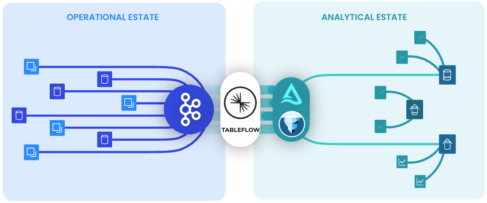
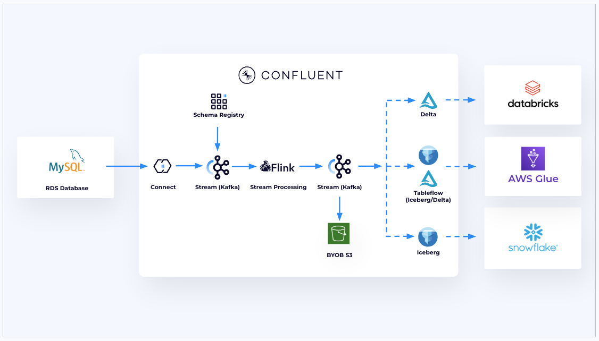

# Tableflow All In One

 

## **Agenda**
1. [Setup Prerequisites](#step-1)
2. [Project Initalization](#step-2)
3. [Set Credentials & Variables](#step-3)
4. [Deployment](#step-4)
5. [Cleanup](#step-5)

 

## <a name="step-1"></a>Setup Prerequisites
Required tools :
  - `Terraform`
  - `Docker`

Credentials & Access:
  - `AWS Access Keys`
  - `Confluent Cloud API Keys (Confluent Cloud Resource Manager)`
  - `Snowflake ACCOUNTADMIN Dashboard Access`

## <a name="step-2"></a>Project Initalization
  - Clone Source Code  
```bash
    git clone https://github.com/confluentinc/global-scale-demos.git
    cd global-scale-demos/oltp-to-olap
```
  - Initialize terraform and install required providers
```bash
    terraform init
```

## <a name="step-3"></a>Set Credentials & Variables
```bash

# Update these variables
export TF_VAR_project_name="changeme-demo"

export TF_VAR_confluent_cloud_api_key="<Confluent Cloud Resource Management API Key Name>"
export TF_VAR_confluent_cloud_api_secret="<Confluent Cloud Resource Management API Key Secret>"

export AWS_ACCESS_KEY_ID="<AWS User API Key ID>"
export AWS_SECRET_ACCESS_KEY="<AWS User API Key Secret>"
export TF_VAR_aws_region="us-west-2"

export TF_VAR_snowflake_organization_name="<Snowflake Organization Name>"
export TF_VAR_snowflake_account_name="<Snowflake Account Name>"
export TF_VAR_snowflake_username="<Snowflake Username>"
export TF_VAR_snowflake_password="<Snowflake Password>"
export TF_VAR_snowflake_role="ACCOUNTADMIN"
```

## <a name="step-4"></a>Deployment
- Verify the resources
```bash
terraform plan
```
- Deploy the resources
```bash
terraform apply
```
> [!NOTE]
> This will take approx 10 minutes to deploy resources over AWS & Confluent


## <a name="step-5"></a>Cleanup

```bash
terraform destroy 
terraform state rm confluent_provider_integration.main 
terraform destroy
```
